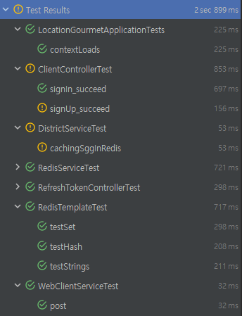
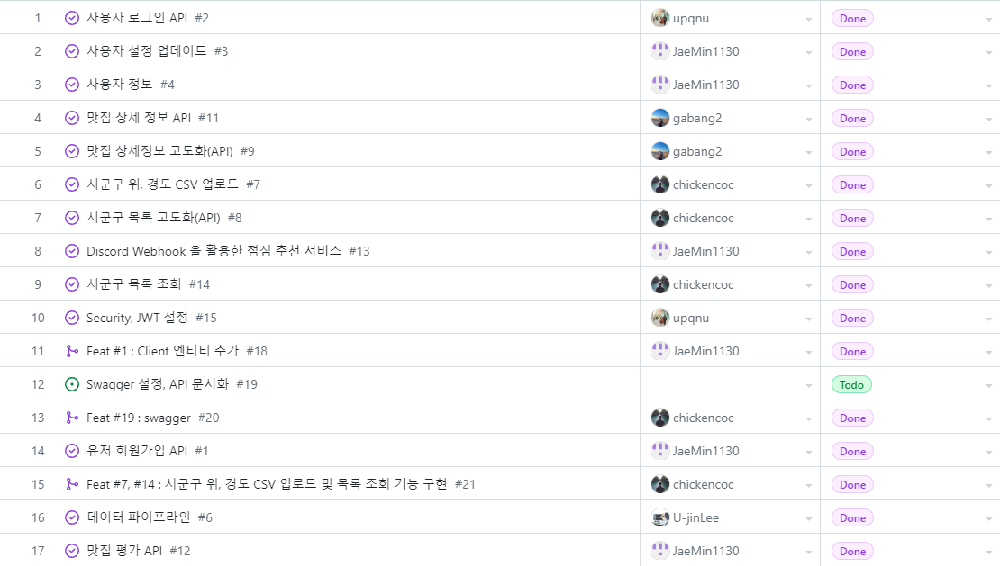

# 지리기반 맛집 추천 웹 서비스, 구루메
## Table of Contents
- [개요](#개요)
- [Skills](#skill)
- [Installation](#Installation)
- [Running Tests](#running-tests)
- [프로젝트 진행 및 이슈 관리](#프로젝트-진행-및-이슈-관리)
- [ERD](#ERD)
- [TIL 및 회고](#til-및-회고)
- [Authors](#authors)

## 개요
본 서비스는 사용자 위치에 맞는 맛집 및 메뉴를 추천해 더 나은 다양한 음식 경험을 제공하고, 음식을 좋아하는 사람들 간의 소통과 공유를 촉진하려 합니다.<br>
`경기도 공공데이터 API`를 활용해, 지역 음식점 목록을 자동으로 업데이트 하고 이를 활용합니다.<br>

## Skill
언어 및 프레임워크:  <br/>
데이터베이스 및 테스트:   <br/>
배포 :  <br/>
ETC: 


## Installation
Install MOA project with gradle
```bash
./gradlew bootjar
./gradlew bootrun
```

## Running Tests
To run tests, run the following command
```bash
  ./gradlew test
```
> <br/>
> 

## 프로젝트 진행 및 이슈 관리
> [](https://github.com/orgs/Team-Enigma23/projects/3/views/1)<br>
> 

## ERD
> <br/>
> - 유저는 위치 정보와 맛집 추천 여부 컬럼을 가진다.
>   - 위치 정보를 통해 유저 근처의 맛집을 추천한다.
>   - 맛집 추천 여부를 받아 원하지 않는다면 추천을 하지 않는다.
> - 평점 추천 서비스를 제공한다.

## TIL 및 회고
- [Embedded 객체](https://ionian-basement-e0c.notion.site/Embedded-7918754e04dd4c4ebcb7636a7f7b4d2b)
- [빌더 패턴, 잘 알고 쓰자!](https://grateful-pharaoh-d2a.notion.site/6d2926a3721543dcb569d1e6e39d9553)
- [@NoArgsConstructor, @AllArgsConstructor ; 그냥 쓰면 안 되는 거였냐? …](https://grateful-pharaoh-d2a.notion.site/NoArgsConstructor-AllArgsConstructor-5e1fa5e4006d47d5b22cac55f8186ca6)
- [JPA auditing ; 말은 거창해도 설정은 쉽다](https://grateful-pharaoh-d2a.notion.site/JPA-auditing-c113279b9e104ceabb59cf36bdfc50cc)
- [JPA dirty checking 그리고 @Transactional](https://grateful-pharaoh-d2a.notion.site/JPA-dirty-checking-Transactional-a58211005a55444487e7d85226acb428)
- [대삽질끝에 알게 된 Spring Security의 Filter 순서의 중요성](https://grateful-pharaoh-d2a.notion.site/Spring-Security-Filter-4c88664e1b5e4cd987e072ada0e25395)

## Authors
<div align="center">
    <table>
        <tr>
            <th>이유진</th>
            <th>윤준영</th>
            <th>김가영</th>
            <th>김성은</th>
            <th>김재민</th>
        </tr>
        <tr>
            <td><a href="https://github.com/U-jinLee">@U-jinLee</a></td>
            <td><a href="https://github.com/upqnu">@upqnu</a></td>
            <td><a href="https://github.com/gabang2">@gabang2</a></td>
            <td><a href="https://github.com/chickencoc">@chickencoc</a></td>
            <td><a href="https://github.com/JaeMin1130">@JaeMin1130</a></td>
        </tr>
    </table>
</div>